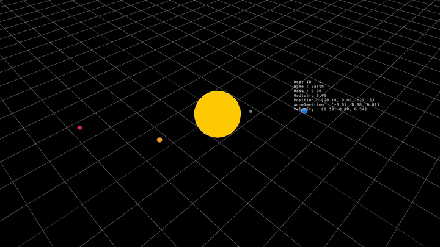

# SpaceBox 



N-Body Simulation program created in C using raylib.
Currently still work in progress.

To run the program, you will need to have raylib installed on your system. You can find installation instructions for raylib on their official website: [raylib](https://www.raylib.com/).
After installing raylib, you can compile the program using the following command:

```bash
make && make run
```

>[!NOTE]
>The program is still under development and have only been tested on linux, so you may encounter bugs or incomplete features. Please report any issues you find on the project's GitHub page.
